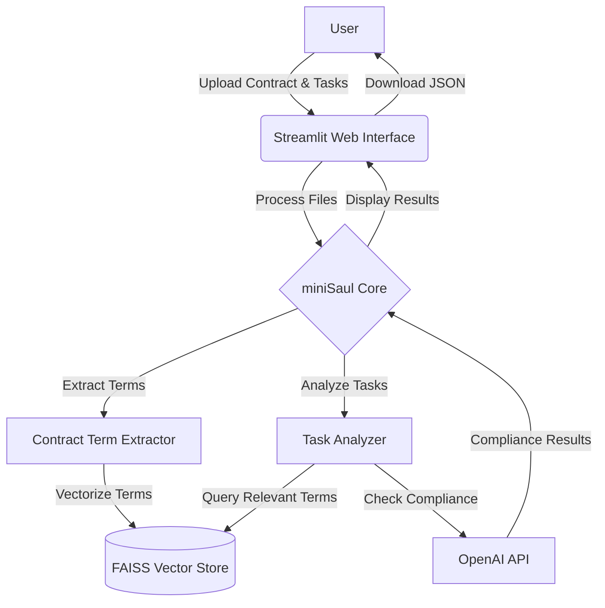

# miniSaul: A Mini-Lawyer for Compliance Check

miniSaul is an AI-powered application designed to extract key terms from contracts and analyze task descriptions for compliance with these terms. It serves as a mini-lawyer, helping to automate the process of contract compliance checking.

## Features

- Extract key terms from contract documents (.docx format)
- Analyze task descriptions and costs for compliance with contract terms
- User-friendly web interface for document upload and result display
- JSON output of compliance check results, available for download

## Technologies Used

- Python
- Streamlit
- LangChain
- OpenAI API
- Docker
- FAISS (CPU version)

## System Design



miniSaul's architecture is designed for efficient contract analysis and task compliance checking:

1. Users upload contract and task files through the Streamlit web interface.
2. The Contract Term Extractor processes the contract, extracting key terms.
3. Extracted terms are vectorized and stored in a FAISS vector store for quick retrieval.
4. The Task Analyzer processes each task, querying the vector store for relevant contract terms.
5. Using the OpenAI API, the system checks task compliance against relevant contract terms.
6. Results are compiled and displayed in the web interface, with an option to download as JSON.

This design ensures scalability and quick response times, leveraging efficient vector search and powerful language models for accurate compliance checking.

## Prerequisites

- Docker and Docker Compose
- OpenAI API key

## Installation

1. Clone the repository:
   ```
   git clone https://github.com/yourusername/miniSaul.git
   cd miniSaul
   ```

2. Set up your OpenAI API key as an environment variable:
   ```
   export OPENAI_API_KEY=<your_api_key_here>
   ```

3. Build and run the Docker container:
   ```
   docker-compose up --build
   ```

## Usage

1. Open your web browser and navigate to `http://localhost:8501`.
2. Upload your contract file (*.docx format) and tasks file (*.xlsx format).
3. Click the "Process Files" button to start the analysis.
4. View the results displayed as JSON output in the app.
5. Download the results for further processing if needed.

## Project Structure

- `app.py`: Main Streamlit application file
- `rag.py`: Contains the core logic for contract term extraction and task analysis
- `Dockerfile`: Defines the Docker image for the application
- `docker-compose.yml`: Configures the Docker services
- `requirements.txt`: Lists the Python dependencies

## Contributing

Contributions to miniSaul are welcome! Please feel free to submit a Pull Request.

## License

[Specify your license here]

## Contact

For any questions or feedback, please contact Francesco Parisio at [francesco.parisio@protonmail.com].

## ToDo

- Add comprehensive unit tests for the LangChain pipeline
- Implement integration tests for the entire system
- Self-host LLMs inference for better control and potentially reduced costs
- Accelerate vector DB with `faiss-gpu` if hardware is available (currently CPU only)
- Build a test suite for the RAG (Retrieval-Augmented Generation) pipeline
